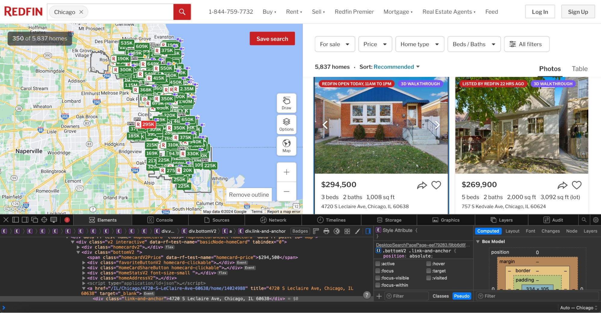
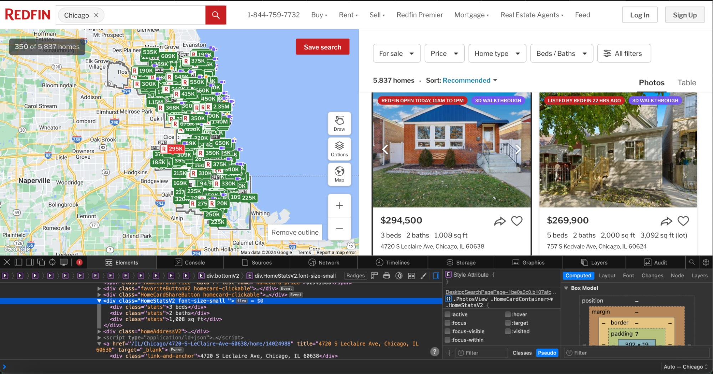

# Scraping Real Estate Data With Python

[](https://oxylabs.go2cloud.org/aff_c?offer_id=7&aff_id=877&url_id=112)

In this guide, you’ll learn how to collect public property data from [Redfin](https://www.redfin.com/) with the help of Oxylabs [Real Estate Scraper API](https://oxylabs.io/products/scraper-api/real-estate) and Python. You can scrape real estate data like prices, sizes, number of beds and baths available, and addresses, increasing the likelihood of finding a good deal or understanding the market better. 

For the full guide, check our [blog post](https://oxylabs.io/blog/scraping-real-estate-data).

## 1. Prepare environment

```python
touch main.py
```

### Install dependencies

```python
pip install bs4 requests pandas
```

### Import libraries

```python
import requests
import pandas as pd
from bs4 import BeautifulSoup
```

## 2. Prepare the API request

```python
USERNAME = "USERNAME"
PASSWORD = "PASSWORD"

payload = {
    "source": "universal",
    "url": "https://www.redfin.com/city/29470/IL/Chicago",
}
```

## 3. Send request

```python
response = requests.post(
    url="https://realtime.oxylabs.io/v1/queries",
    auth=(USERNAME, PASSWORD),
    json=payload,
)
response.raise_for_status()
print(response.status_code)
```
## 4. Extract HTML

```python
html = response.json()["results"][0]["content"]
soup = BeautifulSoup(html, "html.parser")
```

## 5. Parse data from HTML





```python
def extract_data_from_listing(listing):
    price = listing.find("span", {"class": "homecardV2Price"}).get_text(strip=True)
    address = listing.find("span", {"class": "collapsedAddress"}).get_text(strip=True)
    stats = listing.find_all("div", {"class":"stats"})
    try:
        bed_count_elem, bath_count_elem, size_elem = stats[0], stats[1], stats[2]
    except IndexError:
        raise Exception("Got less stats than expected")

    bed_count = bed_count_elem.get_text(strip=True)
    bath_count = bath_count_elem.get_text(strip=True)
    size = size_elem.get_text(strip=True)

    return {
        "price": price,
        "address": address,
        "bed_count": bed_count,
        "bath_count": bath_count,
        "size": size,
    }


data = []

for listing in soup.find_all("div", {"class": "bottomV2"}):
    entry = extract_data_from_listing(listing)
    data.append(entry)
```

## 6. Save to CSV

```python
df = pd.DataFrame(data)
df.to_csv("real_estate_data.csv")
```

## The complete code

```python
import requests
import pandas as pd
from bs4 import BeautifulSoup


def extract_data_from_listing(listing):
    price = listing.find("span", {"class": "homecardV2Price"}).get_text(strip=True)
    address = listing.find("span", {"class": "collapsedAddress"}).get_text(strip=True)
    stats = listing.find_all("div", {"class":"stats"})
    try:
        bed_count_elem, bath_count_elem, size_elem = stats[0], stats[1], stats[2]
    except IndexError:
        raise Exception("Got less stats than expected")

    bed_count = bed_count_elem.get_text(strip=True)
    bath_count = bath_count_elem.get_text(strip=True)
    size = size_elem.get_text(strip=True)

    return {
        "price": price,
        "address": address,
        "bed_count": bed_count,
        "bath_count": bath_count,
        "size": size,
    }


USERNAME = "USERNAME"
PASSWORD = "PASSWORD"

payload = {
    "source": "universal",
    "url": "https://www.redfin.com/city/29470/IL/Chicago",
}

response = requests.post(
    url="https://realtime.oxylabs.io/v1/queries",
    auth=(USERNAME, PASSWORD),
    json=payload,
)
response.raise_for_status()

html = response.json()["results"][0]["content"]
soup = BeautifulSoup(html, "html.parser")

data = []

for listing in soup.find_all("div", {"class": "bottomV2"}):
    entry = extract_data_from_listing(listing)
    data.append(entry)


df = pd.DataFrame(data)
df.to_csv("real_estate_data.csv")
```

## Wrapping up

Using Python along with [Real Estate Scraper API](https://oxylabs.io/products/scraper-api/real-estate) is a seamless way to automate real estate data collection processes required for insights into the real estate market. 

Please refer to our [technical documentation])https://developers.oxylabs.io/scraper-apis/real-estate-scraper-api/redfin) for more on the API parameters and variables found in this tutorial.

If you have any questions, feel free to reach out by sending a message to support@oxylabs.io or live chat.
